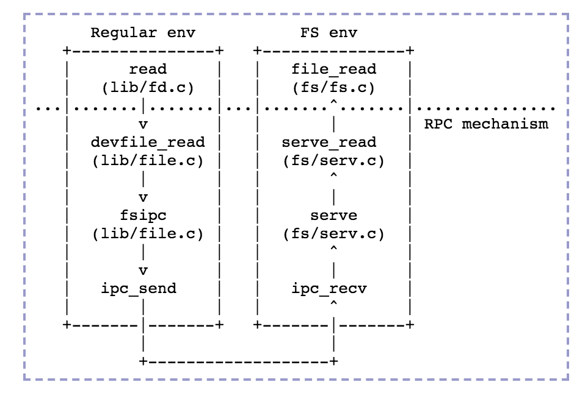

### The File System
In Project-1, you will implement certain key components of a file system. In particular, you will be responsible for reading blocks into the block cache and flushing them back to disk, from the guest; and implementing read and write in the IPC interface. Because you will not be implementing all of the file system yourself, it is very important that you familiarize yourself with the provided code and the various file system interfaces. In JOS, the file system is present in its own environment, with environment type as ENV_TYPE_FS.

#### Disk Access
The file system environment in JOS needs to be able to access the disk. Instead of taking the conventional "monolithic" operating system strategy of adding an IDE disk driver to the kernel along with the necessary system calls to allow the file system to access it, the IDE disk driver is implemented as part of the user-level file system environment.

#### The Block Cache
In our file system, we will implement a simple "buffer cache" (really just a block cache) with the help of the processor's virtual memory system. The code for the block cache is in fs/bc.c.

Our file system will be limited to handling disks of size 3GB or less. We reserve a large, fixed 3GB region of the file system environment's address space, from 0x10000000 (DISKMAP) up to 0xD0000000 (DISKMAP+DISKSIZE), as a "memory mapped" version of the disk. For example, disk block 0 is mapped at virtual address 0x10000000, disk block 1 is mapped at virtual address 0x10001000, and so on. The diskaddr function in fs/bc.c implements this translation from disk block numbers to virtual addresses (along with some sanity checking).

Of course, it would be unreasonable to read the entire disk into memory, so instead we'll implement a form of demand paging, wherein we only allocate pages in the disk map region and read the corresponding block from the disk in response to a page fault in this region. This way, we can pretend that the entire disk is in memory.

Since other environments can't directly call functions in the file system environment, we'll expose access to the file system environment via a remote procedure call, or RPC, abstraction, built atop JOS's IPC mechanism.

Graphically, here's what a call to the file system server (say, read) looks like:

Everything below the dotted line is simply the mechanics of getting a read request from the regular environment to the file system environment.
