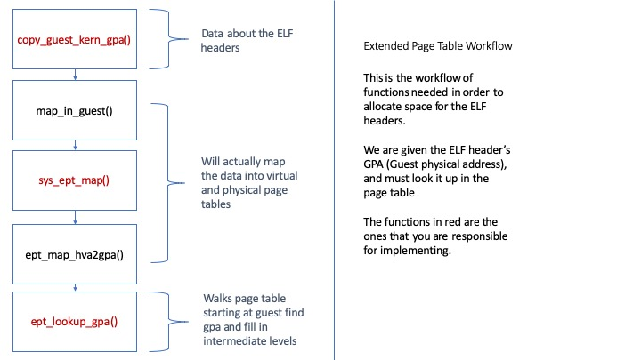

# Project 1 Lab 2

# Part 1: Introduction

In this lab assignment you will be completing the guest bootloader and kernel code. You will be implementing the memory manipulation code to copy the guest kernel and bootloader into the VM. You will also familiarize yourself with the assembly code that helps launch/resume the JOS VM.

Before beginning this lab assignment, read [bootloader.md](bootloader.md).

You will do this lab with your Project 1 group. 

**This lab is generally considered to be the most difficult part of Project 1 -- please start early!**

If you did not receive full points on your code for the previous lab, please contact course staff via a private post on Piazza to get the solution code.

**Due date: February 21, 2023**

Please see Canvas for the GitHub Classroom link for Lab 2. **Please do not put your Lab 2 code in your Lab 1 repo. You must populate the new repository with your existing code** (or code from the solution) in order to get credit for Lab 2.

### Mapping in the guest bootloader and kernel

In user/vmm.c we have provided the structure of the code to set up the guest and bootloader.
In this lab assignment, you will be implementing the functions `copy_guest_kern_gpa`, which copies the guest kernel code into the guest physical address (gpa) space.
You will also implement the function `map_in_guest` that copies the bootloader into the guest.

Like any other user application in JOS, the VMM has the ability to open files, read pages, and map pages into other environments via IPC.
To support this, we have added a new system call `sys_ept_map`, which you must implement in kern/syscall.c.
The high-level difference between `sys_ept_map` and `sys_page_map` is whether the page is added using extended page tables or regular page tables.

Skim Chapter 28.2 of the [Intel manual](http://www.cs.utexas.edu/~vijay/cs378-f17/projects/64-ia-32-architectures-software-developer-vol-3c-part-3-manual.pdf)
to familiarize yourself with low-level EPT programming. Several helpful definitions have been provided in vmm/ept.h.

# Part 2: Pre-lab questions
Please write up the answers to these questions in a Markdown document.

1. Briefly describe EPT and shadow page tables. What are the benefits of using EPT over shadow paging, and vice versa? How do we know that our machine has EPT support?

2. Suppose there are 10 VMs each running 20 processes on a machine. How many page tables total are used with shadow page tables? How many with EPT? 

3. What is an ELF header? What does it do? 

4. Look at the `load_icode()` function in env.c. In your own words, what does this function do? What is the `Proghdr` structure used for? What data does this structure store?

# Part 3: Coding exercise

We recommend looking through these files before starting:

- `inc/memlayout.h` describes and provides an ASCII image of the virtual memory map. 
- `inc/mmu.h` describes how to parse information about a page from the address itself 
- `vmm/ept.h` has function declarations that will be helpful throughout, and a macro for page table walks 
- `lib/fd.c` has system calls that can be used to read files 

## Part A: EPT

### Overview 
You will implement the following functions in this exercise:
- `sys_ept_map()`
- `ept_lookup_gpa()`
- `ept_map_hva2gpa()`
- `copy_guest_kern_gpa()`
- `map_in_guest()`.

First, implement `sys_ept_map()` in kern/syscall.c. You will need to implement `ept_lookup_gpa()` and `ept_map_hva2gpa()` in vmm/ept.c to complete `sys_ept_map()`. Once these are complete, you have enough host-level support function to map the guest bootloader and kernel into the guest VM.

Next, to map the guest bootloader and kernel, you will need to read the kernel's ELF headers and copy the segments into the guest. Implement `copy_guest_kern_gpa()` and `map_in_guest()` in user/vmm.c.

On a high level, in this section, each page of the kernel as well as the bootloader is mapped from the host to the guest at particular physical addresses, and thus the kernel and the bootloader becomes available to the guest for when the guest is launched.

### Workflow

Here is a graphic of the workflow, with descriptions below: 


For the bootloader, we use `map_in_guest()` directly, since the bootloader is only 512 bytes,
whereas the kernel's ELF header must be read by `copy_guest_kern_gpa()`, which should then call `map_in_guest()` for each segment.

The workflow (and hints) for this part is as follows:
1. `copy_guest_kern_gpa()` reads the ELF header from the kernel executable into the struct Elf. 
The kernel ELF contains multiple segments which must be copied from the host to the guest. This function is similar to the one observed in the prelab but has to call something other than `memcpy()` to map the memory because we are in the virtual guest. 

2. `map_in_guest()` breaks down each segment in number of pages, and calls `sys_ept_map()` for each page. You cannot pass in the page directly, but rather will have to use the UTEMP variable. This is defined as a macro in `memlayout.h`

3. `sys_ept_map()` first walks the page table levels at the host (given the srcva), and then gets
the physical page corresponding to the virtual address srcva (i.e. it returns the struct PageInfo).
The corresponding virtual address of this page is then computed using `page2kva()`, which basically acts as the hva in the call to `ept_map_hva2gpa()`.

4. `ept_map_hva2gpa()` does a walk on the page table levels at the guest (given the gpa) using `ept_lookup_gpa()` and then gets a page table entry at level 0 corresponding to the gpa. This function then inserts the physical address corresponding to the hva, in the page table entry returned by `ept_lookup_gpa()`.

5. `ept_lookup_gpa()` does the walk on the page table hierarchy at the guest and returns the page table entry
corresponding to a gpa. It calculates the next index using the address and iterates until it reaches the page table entry at level 0 which points to the actual page.

Once this is complete, the kernel will attempt to run the guest, and will panic because asm_vmrun is incomplete. This error looks like:
```
kernel panic on CPU 0 at ../vmm/vmx.c:637: asm_vmrun is incomplete
```

Don't forget to check for errors!

Do **not** implement `ept_page_insert()` as part of this lab; it will be implemented in a later lab.

## Part B: vmlaunch and vmresume

Next, you will write some assembly code to complete the `asm_vmrun()` function that launches the VM.
The instructions below will help you use the `vmwrite` instruction to set the host stack pointer, as well as the `vmlaunch` and `vmresume` instructions to start the VM.

In order to facilitate interaction between the guest and the JOS host kernel, we copy the guest register state into the environment's `Trapframe` structure.
Thus, you will also write assembly to copy the relevant guest registers to and from this trapframe struct.

Please check prior to starting this section that your code from Lab 0 that implemented `env_runs` is correct and complete. Please check in with the TA if you did not recieve full points. 

Skim Chapter 26 of the [Intel manual](http://www.cs.utexas.edu/~vijay/cs378-f17/projects/64-ia-32-architectures-software-developer-vol-3c-part-3-manual.pdf)
to familiarize yourself with the `vmlaunch` and `vmresume` instructions. 

There are several places in the `asm` statement that need to be modified to complete this exercise. All are labeled in the codebase with "Your code here" and are numbered to match the instructions below. Do not modify any of the provided assembly code. 

1. Add an instruction to set the VMCS `rsp` to the current top of the frame. The instruction to use can be found in the Intel manual linked above. 
2. Add an instruction to check if `vmlaunch` (`env_runs == 1`) or `vmresume` (`env_runs > 1`) is needed, set the condition code appropriately for use below.
3. Write a set of instructions to check the result of the condition flag you set in step 2, and execute either the `vmlaunch` or the `vmresume`. This will require making use of conditional jumps. 

Remove the panic at the end of `asm_vmrun()` and the panic at the end of `vmx_vmrun()`.

Once this is complete, you should be able to run the VM until the guest attempts a `vmcall` instruction, which traps to the host kernel.
Because the host isn't handling traps from the guest yet, the VM will be terminated. You should see an error like:

```
Unhandled VMEXIT, aborting guest.
```

## Hints

### Useful functions and macros

This is a non-exhaustive list of macros and functions that you may find useful while working on this lab.
- `envid2env` (kern/env.c): converts an env ID to an env pointer
- `sys_page_alloc` (kern/syscall.c): allocates a page and maps it at a provided virtual address
- `epte_present` (vmm/ept.c): checks whether an EPT entry's mapping is present 
- `epte_addr` (vmm/ept.c): returns the physical address of an EPT entry
- `epte_page_vaddr` (vmm/ept.c): returns the host kernel virtual address of an EPT entry
- `ADDR_TO_IDX` (vmm/ept.h): returns the index corresponding to a physical address in the nth level of the extended page table
- `page_alloc` (kern/pmap.c): allocates a physical page
- `page2pa` (kern/pmap.h): converts a pointer to a`PageInfo` struct to the physical address of that page
- `PADDR` (kern/pmap.h): converts a kernel virtual address to a physical address

We also suggest looking at the following (non-exhaustive) list of files for other helper functions and macros:
- inc/types.h
- inc/mmu.h
- kern/pmap.h
- vmm/ept.c

### FAQ

1. Is srcva a kernel virtual address? - No. The srcva that is passed into `sys_ept_map()` is not a kernel virtual address. If you want to get the kernel virtual address associated with a srcva, you can look up the PageInfo struct associated with srcva, then look up the kernel virtual address for that PageInfo struct.
2. How can I check if srcva is read-only? - Permissions are set on page table (or extended page table) entries by bitwise AND-ing the entry with some permission bits. There are constants defined in inc/mmu.h and inc/ept.h that correspond to different permissions settings for page table and extended page table entries respectively. You can look up the page table entry for srcva and check its permissions using bitwise operations on the permissions constants and the page table entry. This is also how to work with permissions on extended page table entries
3. How do I check if an address is page-aligned? - An address is page-aligned when it is a multiple of the page size. There are macros and constants defined in inc/mmu.h and inc/types.h that will help you check if an address is a multiple of the page size.
4. What are the possible values of `perm`? - The possible values of perm (for `sys_ept_map()`; other permissions may be set for other situations in the codebase) are defined in inc/ept.h.
5. How are `EPTE_ADDR` and `EPTE_FLAGS` used? - `EPTE_ADDR` and `EPTE_FLAGS` are used in the first few functions defined in vmm/ept.c, which are used to convert EPT entries to their corresponding physical or virtual addresses or to get the flags of an EPT entry. The `epte_addr()` and `epte_page_vaddr()` functions will be useful for this lab; you shouldn't have to deal with EPT entry flags here.
6. What does `ADDR_TO_IDX(pa, n)` do and what is the `n` parameter? - `ADDR_TO_IDX(pa, n)` returns the index corresponding to physical address pa in the nth level of the page table. You can get an idea of how it can be used by looking in the `test_ept_map()` function at the bottom of vmm/ept.c. We suggest using this macro over adapting existing page table walk logic; it will require a lot less code (and thus there is a lower likelihood of mistakes).


# Grading rubric

Total points: 20
Each pre-lab question is worth 1 point (4 total).
Part A is worth 10 points (2 points per function).
Part B is worth 6 points (2 per assembly code section).

# Submission details

**Due date: February 21, 2023**

Assignments will be submitted using GitHub Classroom. You **must** use the new Lab 2 GitHub Classroom link to submit Lab 2. This repo will initially be empty and you will copy your existing codebase into it. You may make as many branches and commits as you would like while working on the lab. When you are ready to submit, make sure all changes have been pushed to the main branch of your group's repository in the classroom. GitHub Classroom will snapshot the repository at the due date, and course staff will leave feedback and grade via a pull request.

Within your repository, please create a Markdown file for the pre-lab answers and ensure that all files required to run the assignment are present. Please indicate if you are using any slip days in the Markdown file.

# Contact Details

Post on Piazza if you have questions or trouble with the assignment. Whenever possible, please post publicly - chances are, other students have the same question or may be able to help. You may post your question anonymously. If you want to share code with course staff, use a private Piazza question.
