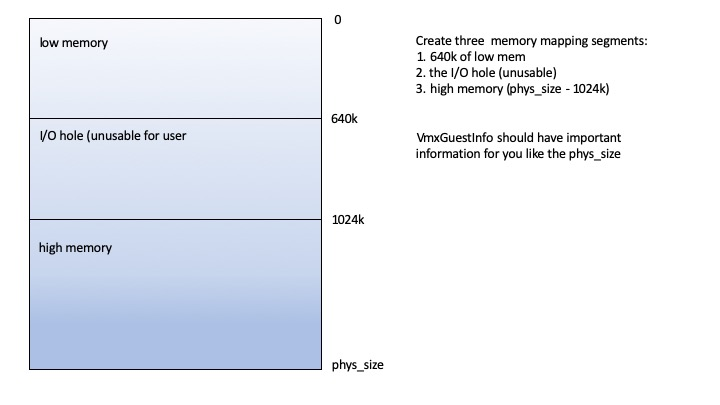

# Project 1 Lab 3

# Part 1: Introduction

The equivalent event to a trap from an application to the operating system is called a VM exit. In this lab, you will be handling some cases of VM exits. In the vmm/vmx.c function `vmexit()`, we have provided some skeleton code to dispatch the major types of exits we expect our guest to provide. You need to add code to identify the reason for the exit from the VMCS. Once that is done, we will be implementing handler functions for certain events in vmm/vmexits.c.

Similar to issuing a system call (e.g., using the int or syscall instruction), a guest can issue a hypercall using the vmcall instruction. The current JOS guest uses three hypercalls: one to read the e820 map, which specifies the physical memory layout to the OS, and two to use host-level IPC. We will handle the first hypercall in this lab.

You will do this lab with your Project 1 group. 

**Due date: March 7, 2023**

# Part 2: Pre-lab questions

Please write up the answers to these questions in a Markdown document.

1. Name 3 different events that can cause a vmexit. You can look through some of the reasons in vmm/vmx.c or use your knowledge of operating systems and virtual machines.

2. Vmexits introduce performance overhead. Describe two sources of these overheads.

3. What is a hypercall? How does using hypercalls impact performance (versus virtualization techniques that do not use hypercalls)?

4. In this lab, you will be responsible for filling in pieces of the codebase to boot the VM. What is a bootloader? How do we ensure isolation between machines booting in memory?

# Part 3: Coding exercise

### Part A: Check exit reason
First, complete the implementation of `vmexit()` by identifying the reason for the exit from the VMCS. You may need to search Chapter 27 of the [Intel manual](http://www.cs.utexas.edu/~vijay/cs378-f17/projects/64-ia-32-architectures-software-developer-vol-3c-part-3-manual.pdf) and look at vmm/vmx.h to solve this part of the exercise.

### Part B: Multi-boot map

JOS is "told" the amount of physical memory it has by the bootloader. JOS's bootloader passes the kernel a multiboot info structure which possibly contains the physical memory map of the system. The memory map may exclude regions of memory that are in use for reasons including IO mappings for devices (e.g., the "memory hole"), space reserved for the BIOS, or physically damaged memory. For more details on how this structure looks and what it contains, refer to the [specification](https://www.gnu.org/software/grub/manual/multiboot/multiboot.html). A typical physical memory map for a PC with 10 GB of memory looks like below.
```
        e820 MEMORY MAP
        address: 0x0000000000000000, length: 0x000000000009f400, type: USABLE
        address: 0x000000000009f400, length: 0x0000000000000c00, type: RESERVED
        address: 0x00000000000f0000, length: 0x0000000000010000, type: RESERVED
        address: 0x0000000000100000, length: 0x00000000dfefd000, type: USABLE
        address: 0x00000000dfffd000, length: 0x0000000000003000, type: RESERVED
        address: 0x00000000fffc0000, length: 0x0000000000040000, type: RESERVED
        address: 0x0000000100000000, length: 0x00000001a0000000, type: USABLE
```

For the JOS guest, rather than emulate a BIOS, we will simply use a vmcall to request a "fake" memory map. 


Implement the `VMX_VMCALL_MBMAP` case of the function `handle_vmcall()` in `vmm/vmexits.c.` Also, be sure to advance the instruction pointer so that the guest doesn't get in an infinite loop.



Set the flags, size, and address fields of the `mbinfo` struct to the correct values.

You will need to make `memory_map_t` objects for each of the sections specified in the diagram above, and write them into the mbinfo memory using the memset or memcpy functions. Look in the multiboot.h file to see all the fields in each of the struct you need to fill out. 

FOR EXAMPLE: after you have initialized all the data in each struct, you can initialize the sections like this:` memcpy(addr, &lomap, sizeof(memory_map_t));`

Once this is done, you will see an error of the form `kernel panic on CPU 0 at ../vmm/vmexits.c:262: cpuid not implemented` instead of the unhandled vmexit error.

### Part C: CPUID

Once the guest gets a little further in boot, it will attempt to discover whether the CPU supports long mode using the `cpuid` instruction. Our VMCS is configured to trap on this instruction so that we can emulate it and hide the presence of VMX, since we have not implemented emulation of VMX in software. 

Implement `handle_cpuid()` in vmm/vmexits.c. `handle_cpuid()` should emulate a cpuid instruction. Check out the comments in the code for more hints. Once the host can emulate the cpuid instruction, your guest should run until it attempts to perform disk I/O, giving a user panic of the form `ipc_host_send not implemented.`

### FAQ


1. What tests should pass after Lab 3? - The VMX extension should pass, in addition to the sys_ept_tests and the start vmxon tests from Lab 2. 
2. What is the difference between `base_addr_low` and `base_addr_high`/`length_low` and `length_high` in `memory_map_t`? - `base_addr_low` should contain the lower (least significant) 32 bits of the section base address and `base_addr_high` should contain the upper 32 bits; same with section length. If the value to store can be represented with fewer than 32 bits, the `*_high` field should be zeroed out. 
3. The autograding script is timing out - Increase the `timeout` argument on 389 of gradelib.py. 60 seconds should be sufficient on the course servers.

# Grading rubric

Total points: 20
Each pre-lab question is worth 1 point (4 total).
Part A is worth 3 points.
Part B is worth 10 points.
Part C is worth 3 points.

# Submission details

**Due date: March 7, 2023**

Assignments will be submitted using GitHub Classroom. You will receive an invite link for the assignment when it is released. You may make as many branches and commits as you would like while working on the lab. When you are ready to submit, make sure all changes have been pushed to the main branch of your group's repository in the classroom. GitHub Classroom will snapshot the repository at the due date, and course staff will leave feedback and grade via a pull request.

Within your repository, please create a Markdown file for the pre-lab answers and ensure that all files required to run the assignment are present. Please indicate if you are using any slip days in the Markdown file.

# Contact details

Post on Piazza if you have questions or trouble with the assignment. Whenever possible, please post publicly - chances are, other students have the same question or may be able to help. You may post your question anonymously. If you want to share code with course staff, use a private Piazza question.
