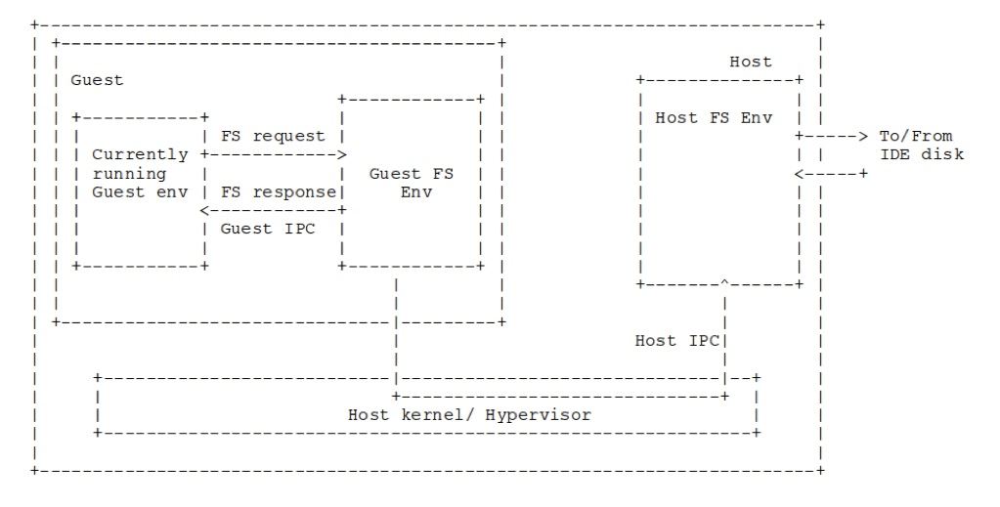

# Project 1 Lab 4

# Part 1: Introduction

In Lab 3, we implemented the memory map portion of `handle_vmcall()`. In this lab, you will handle the two more cases in this function, which deal with sending and receiving IPCs. These hypercalls are used by JOS to perform disk IO via a user-level file system environment. Before starting this lab, read JOS's [file system documentation](file_system.md).

**Due date: March 23, 2023**

# Part 2: Questions

Please write up the answers to these questions in a Markdown document.

1. In this lab, you will implement file IO via IPC. Xen, another paravirtualized hypervisor, uses a different technique to virtualize IO. Describe how IO works in Xen and compare it to JOS's approach.

2. Describe two ways to virtualize storage devices for VMs. Explain the performance and resource utilization characteristics of these two approaches.

3. You will write some code in this lab to implement demand paging for JOS VMs. What is a buffer cache? What is demand paging? How do these methods impact the performance of the file system?

# Part 3: Coding exercise

Recall that JOS uses three hypercall (vmcall) instructions, the first one of which we handled in lab-3. In this lab, we will handle the other two hypercalls, which are related to host-level IPC. JOS has a user-level file system server daemon, similar to a microkernel. We place the guest's disk image as a file on the host file system server. When the guest file system daemon requests disk reads, rather than issuing ide-level commands, we will instead use vmcalls to ask the host file system daemon for regions of the disk image file. This is depicted in the image below.


You will need to do 4 tasks:

1. You need to modify the `bc_pgfault()` amd `flush_block()` in fs/bc.c to issue I/O requests using the `host_read()` and `host_write()` hypercalls, instead of the functions they usually use, when a guest environment is running. Use the macro VMM_GUEST to select different behavior for the guest and host OS. 
2. You will need to complete
	- `ipc_host_send()` and `ipc_host_recv()` in lib/ipc.c to issue vmcalls
	- implement the IPC send and receive hypercalls in `handle_vmcall()` (cases `VMX_VMCALL_IPCSEND` and `VMX_VMCALL_IPCRECV`) (**all students**).
3. You will need to extend the `sys_ipc_try_send()` to detect whether the environment is of type `ENV_TYPE_GUEST` or not. 
4. You need to implement the `ept_page_insert()` function.


The following is a description of register usage by the vmcalls you will be working with. You should use these registers when you implement the vmcalls in `ipc_host_send()` and `ipc_host_recv()` and in `handle_vmcall()`. Read the documentation for `sys_ipc_try_send()` and `sys_ipc_try_recv()` in kern/syscall.c to understand what these values are used for.
- The `VMX_VMCALL_IPCSEND` vmcall places its return value into %rax and expects the following input:
	- The type of the destination env in %rbx
	- The value to send in %rcx
	- The physical address of a page to send in %rdx
	- The permissions for the sent page in %rsi
- The `VMX_VMCALL_IPCRECV` vmcall places its error code into %rax and the received value into %rsi. It expects the destination address for a received page in %rbx. 

The workflow (and hints) for the ipc_* functions is as follows:
1. `handle_vmcall()`: 
	- The `VMX_VMCALL_IPCSEND` portion should load the values from the trapframe registers. 
	- Then it checks the type of the destination environment. If the type is not HOST FS, this function returns E_INVAL.
	- Now, this function traverses all the environments, and sets the `to_env` to the environment ID corresponding to ENV_TYPE_FS at the host. After this is done, it converts the gpa to hva (there's a function for this!) and then calls `sys_ipc_try_send()`
	- The `VMX_VMCALL_IPCRECV` portion just calls `sys_ipc_recv()`, after incrementing the program counter.
2. `sys_ipc_try_send()` checks whether the guest is sending a message to the host or whether the host is sending a message to the guest. 
	- If the curenv type is GUEST and the destination va is below UTOP, it means that the guest is sending a message to the host and it should insert a page in the host's page table. 
	- If the dest environment is GUEST and the source va is below UTOP, it means that the host is sending a message to the guest and it should insert a page in the EPT. 
	- Finally, at the end of this function, if the dest environment is GUEST, then the rsi register of the trapframe should be set with 'value'.
3. `ept_page_insert()` uses `ept_lookup_gpa` to traverse the EPT and insert a page. If there is already a page at the given guest physical address, be sure to decrement its reference count before overwriting the mapping. 
	- You will find functions like `epte_present()`, `epte_addr()`, `pa2page()` to be helpful.
	- You will also need to update the reference counts of the PageInfo struct of the page you insert. There are more details about this in the comment above the function. 

Be sure to check the return values of any functions you call for errors.

Once these steps are complete, you should have a fully running JOS-on-JOS. All autograder test should now pass.

This marks the end of Project 1. 


## FAQ

1.  If you are getting an error that looks like this:
```
user panic in fs at fs/bc.c:142: assertion failed: strcmp(diskaddr(1), "OOPS!\n") == 0
```
Make sure that `ipc_host_recv()` returns `val` if the receive was successful and `r` otherwise. Always returning `r` will cause this assertion to fail. 

2. What is the "received value" that the IPC receive vmcall puts into `%rsi`? - The IPC send and receive calls always exchange a 32 bit value (given as an argument) as well as an optional page. 

3. All of the autograding tests pass, but the output says "VMM Tests: Timeout!" - This is the expected behavior for a full solution. If JOS can start a VM properly, it will open up a shell in that VM. The autograder doesn't do anything with this shell, it just sits on it until it hits its timeout. 

# Grading rubric

Total points: 20
Pre-lab question 1 is worth 2 points. Questions 2 and 3 are each worth 1 point (4 total).
Each of the 4 coding tasks is worth 4 points (16 total).

# Submission details

**Due date: March 23, 2023**

Assignments will be submitted using GitHub Classroom. You will receive an invite link for the assignment when it is released. You may make as many branches and commits as you would like while working on the lab. When you are ready to submit, make sure all changes have been pushed to the main branch of your group's repository in the classroom. GitHub Classroom will snapshot the repository at the due date, and course staff will leave feedback and grade via a pull request.

Within your repository, please create a Markdown file for the pre-lab answers and ensure that all files required to run the assignment are present. Please indicate if you are using any slip days in the Markdown file.

# Contact details

Post on Piazza if you have questions or trouble with the assignment. Whenever possible, please post publicly - chances are, other students have the same question or may be able to help. You may post your question anonymously. If you want to share code with course staff, use a private Piazza question.