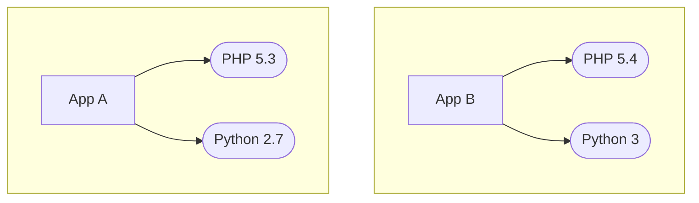

# Containers: the basics
February 23

## Reminders
- Lab 2 was due February 21
  - If using slip days, add a note to markdown file
- Lab 3 due March 7
  - Ask for Lab 2 solution if you are unsure about your Lab 1 code
- Send us Project 2 issues via private note on Piazza
  - Soft deadline is today
  - Please make your groups on Canvas!!
  - Please get issues approved before you start to work on them

## Lecture notes

### Overview
  - Motivation for containers
  - Containers vs. VMs
  - Prior isolation technologies
    - chroot
    - FreeBSD jail
  - Overview of container technologies

A **container** is an isolated set of processes and their dependencies with a virtualized view of the machine.

### Motivation
- VMs are **heavy** and take up a lot of space
  - E.g.: in Lab 0, we had to create a 10GB VM image just to install Ubuntu
  - Overheads to store VMs and send them over the network
- Containers are a **lightweight** virtualization option
  - Order of MBs, not GBs

- Suppose we have two apps, A and B, with slightly different dependencies


- Installing dependencies for App B will update PHP and Python, breaking App A's dependencies. We need to *isolate* A and B from each other, but creating a separate VM for A and B would take up a lot of unnecessary space.
  - Solution: containers! 
- Containers are collections of processes with certain limitations on what they can see/do to provide isolation

- VM stack

```
    VM 0     VM 1
  |---------------|
  |       |       |
  |       |       |
  |       |       |
  |-------|-------|
  |  OS   |   OS  |
  |---------------|
  |  Hypervisor   |
  |---------------|
  |      HW       |
  |---------------|
```
- Each VM has its own OS and kernel
- VM target architecture (and potentially OS) must be compatible with the hypervisor, but does not need to match host OS/architecture

- Container stack
```
     C 0     C 1
  |---------------|
  |       |       |
  |       |       |
  |       |       |
  |---------------|
      |       |
      v       v
  |---------------|    
  |    Host OS    |
  |---------------|
  |      HW       |
  |---------------|
```
- Each container uses the host OS/kernel
  - If one container causes a kernel panic in the host, all other containers are impacted
  - Containers cannot run different operating systems
    - Exception: Linux containers can run on a Windows host because Windows can run a Linux distribution alongside the Windows OS
      - Windows containers cannot run on a Linux host
- Containers can use different Linux distributions because a distribution is basically user space utilities + a Linux kernel

- How are containers used?
  - Developing and deploying code
    - Before containers: develop on one machine, maintain test machines that hopefully match user/deployment environments
    - With containers: same container can be used to develop, test, and deploy an application together with its dependencies
  - Researchers often package code into containers so that others can use their research project/replicate their results/compare against it without a lengthy setup process

- Docker is a well-known container platform
  - Docker did not invent containers and did not develop the technologies used by containers
  - Main source of success: packaging complicated containerization tech into an easy-to-use product at a time when people were interested in using containers

### Containers vs. VMs
  - Container isolation is weaker; need to trust containers more than we trust VMs
  - Containers are smaller - order of MBs, whereas VMs must take up GBs of space
  - Container target arch and kernel must match the host, whereas hypervisors allow different OSes and often different architectures
  - Containers do not run on a hypervisor; all containerization features are present in the kernel and available in user space
  - Containers are best for stateless applications

### Prior isolation technologies

- Key considerations for building containers
  - Visibility: what can the container see (in the file system, on the network, etc.)?
  - Resources: what resources can the container use (CPU, storage, network, etc.)?
  - Privileges: the container's root user should have lower privileges than the host root; processes should not be able to break out by becoming root.

#### chroot
- Applications have access to the file system mounted at a root directory `/`
  ```mermaid
  graph TD

  root["/"]
  blank[  ]
  blank2[  ]
  bin[bin]
  usr[usr]
  app[app]
  home[home]

  foo
  bar
  baz

  root --- blank
  blank --- bin
  blank --- usr
  blank --- home
  blank --- app

  app --- blank2
  blank2 --- foo
  blank2 --- bar
  blank2 --- baz


  style blank fill-opacity:0, stroke-opacity:0, height:0px;
  style blank2 fill-opacity:0, stroke-opacity:0, height:0px;
  ```
  - We might want to let an app read and write to files in `/app`, but not to `/bin`, `/usr`, or `/home`
  - We could set up access control lists, but this is hard to maintain for every application
- chroot makes it look to a process that `/app` is the root of the file system - not `/`
  - Using chroot, the application would see this: 
  ```mermaid
  graph TD

  root["/"]
  blank[  ]
  blank2[  ]

  foo
  bar
  baz

  root --- blank2
  blank2 --- foo
  blank2 --- bar
  blank2 --- baz

  style blank fill-opacity:0, stroke-opacity:0, height:0px;
  style blank2 fill-opacity:0, stroke-opacity:0, height:0px;
  ```
- Limitations
  - If the application ever gets root access, it can break out of the chroot jail
    - Ideally, root perms inside a container would not allow a process to break out of the container
  - Application can mount devices in its visible file tree if it knows the name of the device
    - ...including mounting the device that contains the directories we are trying to hide
- chroot primarily protects us from software bugs; it is not sufficient to protect against a malicious application
- Implemented in the Linux kernel as a system call
- chroot provides **visibility** limitations, but no resource usage restrictions

#### FreeBSD jail
- Originated in FreeBSD operating system
  - Has a lot of advanced features unavailable in Linux - this is one of them
- Isolation mechanism for separating processes from each other
- Processes can be started in a *jail*
  - All child processes will also be in jail
  - A running process cannot be placed in jail
- Like chroot, a jail can be set up so that processes see a different root dir from the rest of the system
  - Unlike chroot, the application cannot mount new devices in jail
- Becoming root in FreeBSD jail does not allow a process to break out of jail; jail root has lower privileges than regular root
- The jailed process gets its own IP address, hostname, and networking stack
  - Makes it easier to run networked services; e.g., if you want to run two webservers on port 80 on the same machine
- Provides **visibility** limitations, but still no resource restrictions
- Implemented in the FreeBSD OS as system call and utilities
  - Required 260 changes to FreeBSD kernel
    - E.g.: checking that a process calling `mount()` is not in jail, checking whether a user is regular root or jail root when attempting to perform privileged operations
    - Restrictions are all enforced by the kernel
    - Devs took ~1 year to develop FreeBSD jail before it was added

### Container technologies

- We will go into more detail about these next class.
- These technologies let us **virtualize the view of the machine** in a container

- Control groups (`cgroups`)
  - Restrict resources that can be used by a process + its children
    - E.g.: limit a process + children to 1GB of memory
- Kernel namespaces
  - Namespaces determine what is and isn't visible to processes
  - By default, all processes are in the same namespace; new namespaces can be created and processes added to restrict what is visible to those processes
  - Can be used to limit which processes can see/use IP addresses, host names, root directory, etc.
  - Can also cover info like user IDs and process IDs - members of different namespaces can have the same process or user IDs
  - Root in a namespace can be separate and have lower privileges than root outside of it
- Overlay file system
  - Allows deduplication of shared dependencies between different containers
  - FS is built out of layers
    - Each app/lib lives in a layer. Containers can share layers if they both need that dependency
  - All changes/new installations are written to a new layer

- All three of these are provided by the Linux kernel and can be set up from user space
  - All predate containers and can be used for regular processes as well